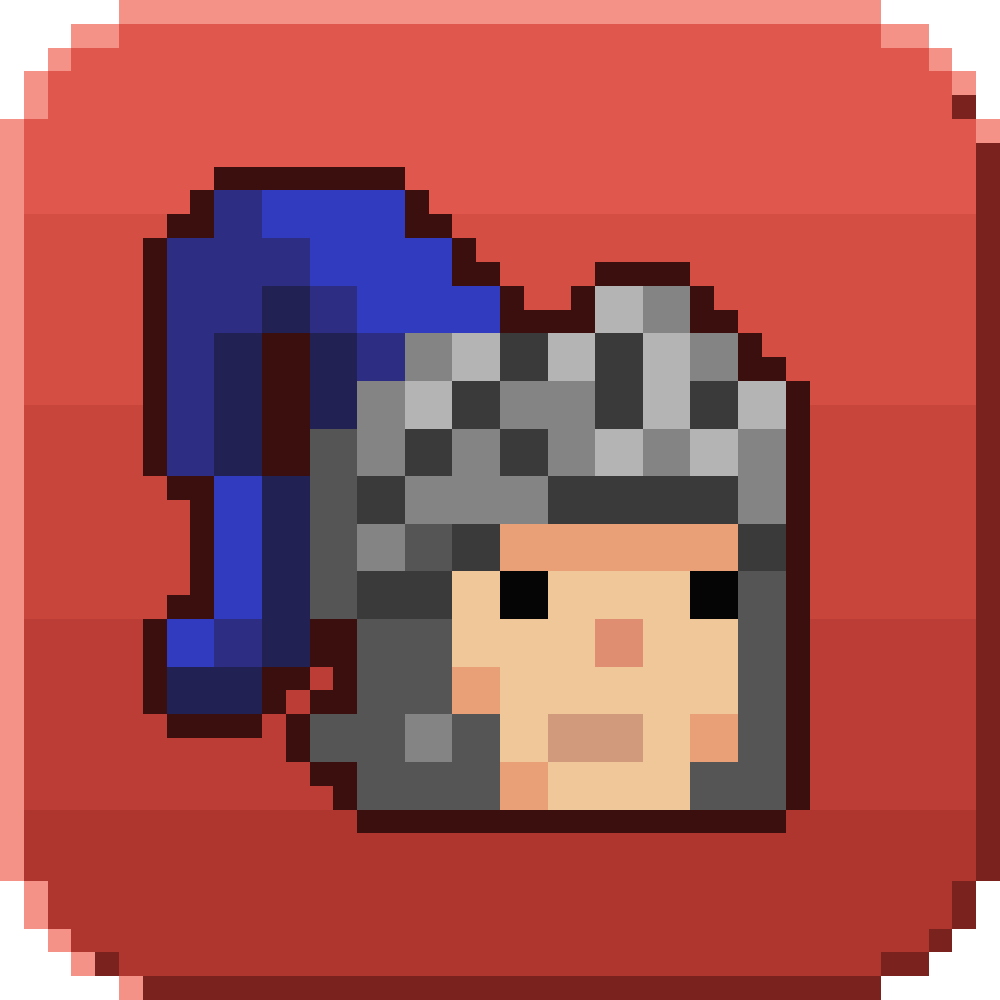

# Squire

Squire is your OSRS companion: an AI in your RuneLite sidebar that knows your account, ready to help you gear up and prepare like a good squire should. Ask what to do next, how to gear for a boss, what a DPS upgrade is worth, or where to get an item, and get answers based on your real levels, quests, diaries, bank and gear.

## Features

- **Chat that knows your account**: progression advice for mains, ironmen and hardcores, checked against your actual requirements
- **Your plan**: a roadmap of checkpoints (Barrows gloves, Fire cape, your first raid...) that Squire builds with you and ticks off as you play, on your Home page
- **Gear you can act on**: setups shown like the game's equipment screen, with DPS; click a slot to try your other items, then copy it to Inventory Setups
- **Session reviews**: "watch my Gauntlet run" and Squire observes it silently, then Squire debriefs you afterwards with specific fixes. Nothing is shown during play
- **Boss setups**: inventory setups, Bank Tags tabs and Ground Markers to import into those plugins
- **Progress and activity**: your account rank, time played, XP and kills over any period, and your personal best history with the gear you wore, with one-click questions for Squire on every card
- **Memory**: Squire remembers your goals, preferences and decisions between chats; see or forget them in Settings, Memory
- **In-game chat**: type `::squire <question>` or press Ctrl+B to ask from the chatbox
- **Use it in other AI apps**: connect Claude, ChatGPT, Cursor or any MCP client from Settings, Connect an AI app
- **Your choice of model**: Squire's free models, or your own Anthropic, OpenAI, xAI or Google key
- **Your data, your call**: choose what's synced and hide items in Settings, What's synced; delete everything any time

## Data and privacy

Nothing is sent until you press **Turn on Squire**. After that the plugin sends the following to the Squire server:

- your character name and progress (levels, quests, diaries, combat achievements, collection log, kill counts)
- your bank, inventory, equipment and notable loot
- what you spend your time on, your world and location
- your messages to Squire, which are answered by an AI model
- your IP address, which any server sees. Squire only keeps a one-way hash of it to limit sign-ups

It never sends your password, other players' information or your chat with other players. You can delete everything from **Settings → Delete my data**. The full privacy notice is at the server's `/privacy` page.

Squire gives advice; it does not play the game for you, type into your chatbox or give live boss mechanics.

## Free tier and your own key

Everyone gets a number of free messages a day on Squire's models. For unlimited use, add your own API key in **Settings → Your AI keys** (Anthropic, OpenAI, xAI or Google): every model your key can use appears at the top of the model list, and chats on it are billed to your account with that provider. A [Vercel AI Gateway](https://vercel.com/ai-gateway) key in the plugin's configuration also works. Keys are sent once, stored encrypted on the server and never shown again.

## Server

The server (Next.js, Postgres, the agent and its tools) is at https://github.com/austinmrobinson/squire, with architecture docs in its README.

## Credits

Interface icons are from [Pixelarticons](https://pixelarticons.com) (MIT). The progression guide follows [Ladlor's Ironman Progression Chart](https://ladlorchart.com/) and [Yazi's Ironman Gear Progression 2025](https://oldschool.runescape.wiki/w/Guide:Yazi%27s_Ironman_Gear_Progression_2025) on the OSRS Wiki.
